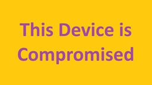

<!-- What they can or cannot do during the event and point out the computer misuse act -->

# Scope for Cyber Security

This is very important that you read and understand this document.

As always you **MUST** be concious of the [Computer Misuse Act 1990](https://www.legislation.gov.uk/ukpga/1990/18/contents) throughout this event and outside of it.

This environment, although somewhat controlled, is still governed by law and legislation. You **MUST NOT** break the computer misuse act in any way. Doing so will have you removed from the event and there will be sanctions.

However, part of the scope for this event does involve limited penetration testing of the API provided alone. As well as mock physical access to the systems we are using in each "office".

# API Penetration Rules and Information

There are a number of known vulnerabilities in the API server.

If you find a vulnerability in the API you must follow the steps below:

1. Record the event including action taken and the outcome
2. Produce report by a cyber analyst (anyone can take on this role at any time). This must include:
   1. An executive summary - overview of the issue without technical jargon
   2. Detailed findings - what the vulnerability is, how it can be abused, the outcome from it being abused with evidence of findings
   3. A risk rating - how easy is it to find, what are the (possible) negative outcomes from this being abused
   4. Recommendations - how would one go about fixing the problem
3. Provide the report to an event organiser

If the vulnerability will then be patched for the next day and both teams will be made aware of the issue and outcomes.

# System's access

Additionally you will be able to "compromise" a computer. As this is a mock environment and we do not want you creating malware the only way you can "compromise" a computer is to set it's background to [this image](./imgs/Compromised.png).

If a device has this background then the device is then "compromise" and we will stop the team with the compromised machine and they will have to start "recovery". At this time the team will convene with an event organiser and talk through the situation.

Points awarded and deducted will be decided after this conversation and then the team affected will be able to continue with their task.